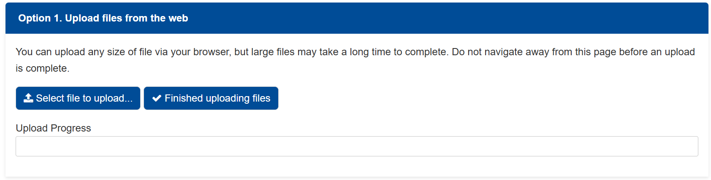
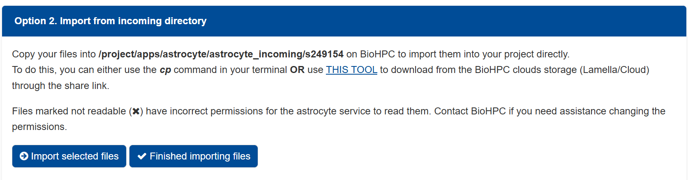
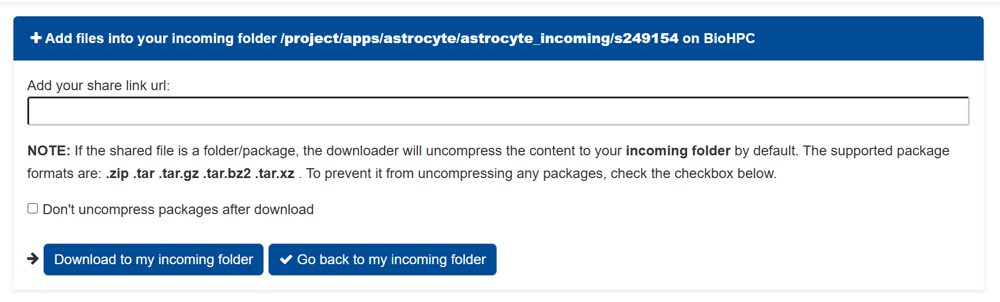

Cloud Usage
===========

This page covers how the lab uses cloud-based tools and how to properly
access and manage shared resources.

General Access
--------------

- All computing, whether on-premises or remote, should be done on
  `BioHPC <https://portal.biohpc.swmed.edu/content/>`_.
- New users should register for an account at
  `BioHPC account registration <https://portal.biohpc.swmed.edu/accounts/register/>`_.
- New users are required to attend mandatory BioHPC training on the first
  Wednesday of every month. BioHPC accounts cannot be activated without
  training attendance.
- BioHPC access is provided mainly through
  `web based visualization <https://portal.biohpc.swmed.edu/intranet/terminal/webgui/>`_.
- It is recommended to download a
  `VNC client <https://github.com/TurboVNC/turbovnc/releases>`_ for WebGUI
  access.
- Remote BioHPC access requires VPN access through Global Protect. Information
  on how to set up remote access can be found
  `here <https://www.utsouthwestern.edu/about-us/administrative-offices/information-resources/working-remotely.html>`_.

Filesystem Navigation
---------------------

These are fundamental operations for moving and navigating to data on BioHPC
nodes.

- Print Working Directory (pwd): Displays the full path of the directory you
  are currently in, to determine your location within the filesystem.

.. code-block:: bash

   pwd

- List Directory Contents (ls): Shows the files and folders in your current
  directory. Use ls -l for detailed information or ls -a to see hidden files.

.. code-block:: bash

   ls -la

- Change Directory (cd): Navigates to a different directory. Use cd - to go
  to the previous directory, cd ~ to go to your home directory, or provide a
  path to navigate to.

.. code-block:: bash

   cd /path/to/data/

- Move or Rename Data (mv): Moves files or directories from one location to
  another. This same command is also used to rename files.

.. code-block:: bash

   mv data_file.csv /new/location/
   mv old_name.txt new_name.txt

- Copy Data (cp): Duplicates files. If you need to copy an entire directory
  and all of its contents, be sure to use the recursive flag (-r).

.. code-block:: bash

   cp source_file.txt destination_file.txt
   cp source_file.txt /destination/data_folder/
   cp -r /source/data_folder/ /destination/data_folder/

Data Processing
---------------

Microscopy data can now be processed through
`Astrocyte <https://astrocyte.biohpc.swmed.edu/>`_. An existing BioHPC account
is required for Astrocyte access. Astrocyte accounts also share the same
credentials as BioHPC accounts.

Project Creation
^^^^^^^^^^^^^^^^

Workflows can only be run through the usage of Astrocyte projects. Use these
steps to create a project in Astrocyte and upload workflow input data.

- Go to the My Project page in Astrocyte.

- Scroll to the create project section.
- Enter a project name, then press Create.

.. image:: images/astrocyte-create-project-section.png
  :alt: Screenshot: Create project section with project name and Create button

- After the project opens, find the Input area and click Upload

.. image:: images/astrocyte-project-input-upload.png
  :alt: Screenshot: Upload button under the project Input area.

- Upload the input data through the upload channel you want to use.

Data Staging
^^^^^^^^^^^^

Data can be uploaded to an Astrocyte project through a variety of provided
channels. If you have not yet created a project, refer to the steps above.

- Data can be directly uploaded through the WebGUI.

- Data can be copied directly from the BioHPC portal via command line.

- Data can be uploaded through Lamella via share link.

Provided Workflows
^^^^^^^^^^^^^^^^^^

All workflows can be found at the
`lab page <https://astrocyte.biohpc.swmed.edu/brand/Dean_lab/browse/>`_. View
each workflow's attached documentation for additional information.

- 3D GPU Deskew Workflow: This workflow normalizes selected ctASLM/light-sheet
  microscopy image files to OME-Zarr and runs GPU-accelerated shear/rotation
  operations.
- 3D GPU Deconvolution Workflow: This workflow normalizes selected microscopy
  image volumes to OME-Zarr, estimates a blind PSF, and runs GPU-accelerated
  Richardson-Lucy deconvolution.
- Neuroglancer Visualization: This workflow visualizes 3D OME-Zarr volumes.

Resource Management
-------------------

Both BioHPC and Astrocyte bill for compute resource usage based on the time
and type of nodes allocated. To ensure efficient use of your allocations and
to avoid unnecessary charges, always try to keep your resource usage to a
minimum. For information on BioHPC data management, view :doc:`data-management`.

Generic Queues
^^^^^^^^^^^^^^

If you do not require a specific hardware configuration, you can use the
generic queues to get your jobs running efficiently:

- super: Generic high-performance CPU node.
- GPU: Generic GPU node.

These generic queues act as a sliding scale for resources. They will
automatically attempt to allocate the weakest available node first. If those
are fully occupied, the system will look to the next strongest node in the
queue (e.g., if all 128GB nodes are busy, the queue will automatically try to
place your job on an available 256GB node).

Available BioHPC Nodes
^^^^^^^^^^^^^^^^^^^^^^

Below is a simplified overview of the available CPU and GPU nodes and what
they are best suited for.

CPU Nodes
"""""""""

- 128GB: Entry-level memory node, best for light data processing and basic
  analysis.
- 256GB / 256GBv1 / 256GBv2: Standard mid-tier memory nodes, ideal for
  everyday bioinformatic workflows and average datasets.
- 384GB: High-memory node, meant for memory-heavy jobs that exceed standard
  system limits.
- 512GB: Maximum-capacity memory node, reserved for massive datasets and
  extreme processing tasks.

GPU Nodes
"""""""""

- GPU2H200: Ultra-high-performance node with next-generation H200 GPUs for
  maximum computation speed and massive AI or image processing workloads.
- GPU4A100 / GPU4H100: Heavy-duty multi-GPU nodes with four top-tier cards,
  ideal for intensive parallel computing and large-scale deep learning models.
- GPU4v100: Multi-GPU node with four previous-generation V100 cards for
  workflows optimized across multiple GPUs.
- GPUA100 / GPUL4 / GPURTX6k: Modern single-GPU nodes ranging from lightweight
  acceleration (L4) to high-memory image processing and heavy graphics
  workflows (A100, RTX 6000).
- GPUp100 / GPUp4 / GPUp40 / GPUv100s: Standard single and dual GPU nodes
  suitable for everyday accelerated tasks, smaller image sets, and general
  GPU-enabled pipelines.

Related pages
-------------

- :doc:`digital-tools` for account and platform setup
- :doc:`data-management` for information on handling BioHPC data
- :doc:`policies` for lab expectations that intersect with record keeping
